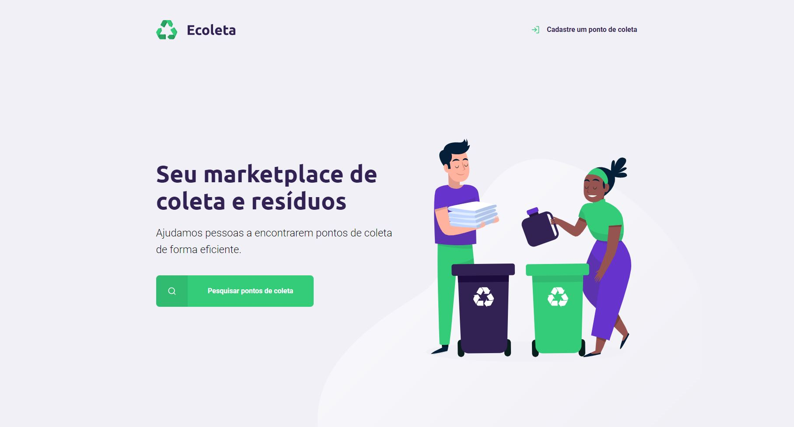

<h1 align="center">
    
</h1>

<h1 align="center">
    
</h1>

## 📝 Sobre

O projeto **Ecoleta** é um site que tem como intuito fornecer pontos para coleta de resíduos, de maneira que facilite para as pessoas encontrarem de acordo com sua cidade.

---

## 🚀 Tecnologias Utilizadas

- [HTML5](https://www.w3schools.com/html/)
- [CSS3](https://www.w3schools.com/css/)
- [ECMAScript6](https://www.w3schools.com/js/js_es6.asp)
- [NodeJS](https://nodejs.org/en/docs/guides/getting-started-guide/)
- [Nunjucks](https://mozilla.github.io/nunjucks/getting-started.html)

---

## 💻 Baixar e Executar o Projeto

```bash

    # Clonar o repositório do GIT
    $ git clone https://github.com/maumauagain/ecoleta

    # Acessar o diretório contendo o projeto
    $ cd ecoleta

    # Instalar as dependências do projeto
    $ npm install

    # Iniciar o projeto
    $ npm start

```

---

<h4 align="center">
    Desenvolvido por <a href="https://www.linkedin.com/in/amauri-martins-júnior-73090a169" target="_blank">Amauri Martins </a> ⚓
</h4>

